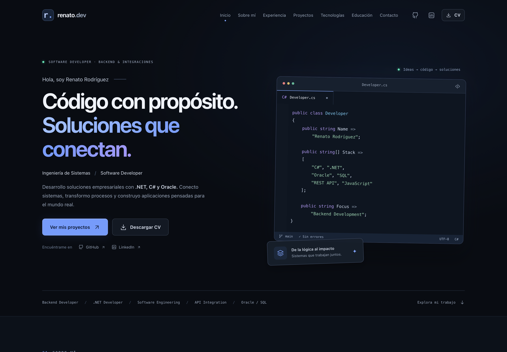

# Renato Rodríguez · Portafolio profesional

Portafolio estático de un desarrollador de software enfocado en backend, .NET, C#, Oracle e integraciones empresariales. Creado con HTML5, CSS3 y JavaScript Vanilla; funciona sin instalación, compilación, dependencias ni servidor.

## Ejecutar

Abre `index.html` directamente en Chrome, Edge, Firefox o Safari actualizado. También puedes usar **Open with Live Server** desde Visual Studio Code. Conserva todos los archivos en su estructura original.

Los scripts se cargan con `defer`, sin módulos ES ni peticiones `fetch`, para admitir la apertura mediante `file://`. No se utiliza Node.js, backend, base de datos, autenticación ni panel administrativo.

## Características

- Diseño oscuro, editor C# ilustrativo y recursos locales sin fuentes externas.
- Ocho proyectos generados desde un único archivo de datos.
- Buscador en tiempo real, coincidencias sin tildes, búsqueda por varias palabras y filtros combinados.
- Detalles mediante `project.html?id=1`, arquitectura HTML/CSS y estado de proyecto inexistente.
- Menú móvil, navegación activa, barra de progreso, botón volver arriba y animaciones con Intersection Observer.
- Respeto de `prefers-reduced-motion`, enlaces accesibles, foco visible y formulario con errores asociados a cada campo.
- Formulario que valida y prepara un correo con `mailto:` cuando se configura un destinatario. Nunca afirma haber enviado un mensaje.
- Enlaces de correo, GitHub y LinkedIn configurados.
- Distribución de proyectos: tres columnas en escritorio, dos hasta 1024 px y una hasta 539 px.

## Estructura

```text
PORTAFOLIO/
├── index.html
├── project.html
├── css/
│   ├── styles.css
│   ├── projects.css
│   └── responsive.css
├── js/
│   ├── config.js
│   ├── ui.js
│   ├── app.js
│   ├── projects-data.js
│   ├── projects.js
│   ├── project-detail.js
│   ├── animations.js
│   └── contact.js
├── assets/
│   ├── images/
│   │   ├── projects/
│   │   ├── profile/
│   │   └── backgrounds/
│   ├── icons/favicon.svg
├── .gitignore
├── .nojekyll
└── README.md
```

## Tema claro y oscuro

El botón de sol/luna del encabezado cambia el tema en ambas páginas. Se inicia en oscuro y la elección se guarda en LocalStorage con la clave `portfolio-theme`. Si el navegador bloquea el almacenamiento, el botón sigue funcionando durante la visita. Con `file://`, la persistencia entre archivos depende del navegador; Live Server permite compartir la preferencia entre ambas páginas.

`js/theme.js` se carga antes del CSS para aplicar la preferencia sin un destello del tema anterior; es la única excepción al uso de `defer`. Las variantes claras están en `css/themes.css`. El editor de código y las ilustraciones conservan sus fondos oscuros.

## Personalización

Edita `js/config.js`:

| Propiedad | Uso |
| --- | --- |
| `email` | Correo público y destinatario: `renatorod32@gmail.com`. |
| `github` | Perfil configurado: `https://github.com/renatiur`. |
| `linkedin` | Perfil proporcionado, ya configurado. |
| `siteUrl` | URL HTTPS pública, incluida la subcarpeta del repositorio si corresponde. |
| `metrics` | Indicadores de la sección Sobre mí. |
| `technologies` | Categorías y tecnologías del grid. |

El correo, las fechas de experiencia y la formación se actualizaron desde el CV. GitHub está configurado con el perfil `renatiur`. No se han inventado fechas para los proyectos empresariales. Los enlaces pendientes explican su estado al activarse. El indicador `+10` proviene del requerimiento y no representa el número de fichas publicadas, que actualmente es ocho.

La identidad visible y los textos editoriales se pueden modificar en `index.html`; `config.name` sirve como referencia central del perfil, pero no reemplaza automáticamente el texto del HTML. Los colores y las medidas están en las variables de `css/styles.css`.

## Agregar o modificar proyectos

Edita exclusivamente `js/projects-data.js`. Cada objeto incluye:

```javascript
{
  id: 9,
  slug: 'nombre-del-proyecto',
  title: 'Nombre del proyecto',
  subtitle: 'Contexto breve',
  shortDescription: 'Resumen para la tarjeta.',
  description: 'Descripción completa.',
  problem: 'Problema abordado.',
  solution: 'Solución implementada.',
  role: 'Tu participación real.',
  challenges: ['Desafío técnico'],
  results: ['Resultado verificable'],
  context: 'Proyecto personal',
  category: 'Web',
  categories: ['Web', 'Backend', 'API'],
  year: null,
  status: 'En desarrollo',
  technologies: ['C#', '.NET'],
  features: ['Funcionalidad implementada'],
  mainImage: 'assets/images/projects/nombre-del-proyecto.webp',
  imageCaption: 'Descripción de la imagen.',
  images: [
    {
      src: 'assets/images/projects/nombre-detalle.webp',
      alt: 'Descripción accesible de la pantalla',
      caption: 'Vista del módulo'
    }
  ],
  architecture: ['Frontend', 'REST API', 'Lógica de negocio', 'Base de datos'],
  learned: 'Aprendizajes del proyecto.'
}
```

Usa un `id` numérico positivo único. `category` es la categoría visible; `categories` permite aparecer en varios filtros. Los filtros disponibles se definen en `js/projects.js`. `architecture: []` oculta el diagrama; `images: []` muestra el aviso de confidencialidad. Las fichas y el contador se actualizan automáticamente. Los destacados de experiencia se eligen por ID en `js/app.js`.

Los años se muestran como «por confirmar» hasta que los completes. Solo Control de Accesos se marca en producción porque ese estado fue proporcionado. «Caso profesional» identifica las demás fichas sin atribuir un estado de despliegue no confirmado.

Problemas, soluciones, participación, aprendizajes y resultados son redacciones iniciales basadas en las funciones descritas. Revísalas para reflejar tu participación exacta antes de compartir el portafolio. No se atribuyen mejoras porcentuales ni plazos inventados.

## Imágenes y capturas

Las ocho ilustraciones SVG locales representan pantallas y flujos conceptuales; **no son capturas de los sistemas reales**. Son recursos vectoriales ligeros, adecuados para estos diagramas visuales. La arquitectura del detalle utiliza HTML y CSS, independientemente de estas ilustraciones.

Puedes reemplazar las ilustraciones por imágenes WebP o AVIF autorizadas, preferentemente en proporción 600 × 330 y por debajo de 200 KB. Actualiza `mainImage`, `imageCaption` y las descripciones alternativas de la galería. Evita espacios y tildes en nombres de archivos. La galería admite imágenes locales dentro de `assets/` o URLs HTTPS.

Las carpetas `profile` y `backgrounds` quedan reservadas para tus recursos; el diseño actual no necesita una foto. Las tarjetas usan carga diferida y dimensiones explícitas.

## CV

El portafolio no ofrece descarga de CV y no incluye el PDF entre sus archivos publicados. El documento original se conserva fuera del repositorio.

## Contacto

1. El destinatario ya está configurado con el correo del CV. Puedes cambiarlo en `js/config.js`.
2. El formulario valida nombre, correo, asunto y mensaje, y muestra un contador de hasta 2000 caracteres.
3. Al pulsar «Enviar mensaje», se prepara el contenido y aparece «Abrir correo».
4. Ese enlace abre la aplicación de correo del visitante. El visitante debe confirmar el envío allí.

Sin un correo configurado, se explica que no se envió ningún mensaje y se ofrece LinkedIn como alternativa. No se guardan datos personales en LocalStorage ni se realizan peticiones externas. Copiar correo usa Clipboard API; cuando el navegador no lo permite, selecciona el texto para copiarlo manualmente.

Una futura integración con EmailJS o Formspree puede reemplazar el comportamiento de envío en `contact.js`, manteniendo la validación. No existe ninguna integración externa activa ni se incluyen claves.

## SEO

Ambas páginas incluyen título, descripción, autor, keywords, Open Graph, Twitter Card, favicon y theme color. Al configurar `siteUrl`, se añaden canonical y `og:url` con la ruta publicada. La página de detalle actualiza título y descripción según el proyecto.

Las plataformas sociales que no ejecutan JavaScript verán los metadatos genéricos del HTML en las páginas de detalle. Para vistas sociales particulares por proyecto sería necesario crear HTML estático independiente para cada ficha. No se incluye un canonical ficticio ni un dominio inventado.

## Publicación

El repositorio es `https://github.com/renatiur/PORTAFOLIO` y la URL de GitHub Pages configurada es `https://renatiur.github.io/PORTAFOLIO/`. La configuración local de esta URL no activa el alojamiento.

### Activar GitHub Pages

1. Si GitHub muestra «Upgrade or make this repository public», abre **Settings → General → Danger Zone → Change repository visibility → Change to public** y confirma el cambio.
2. Entra a **Settings → Pages** y selecciona **Deploy from a branch**, rama `main`, carpeta `/(root)` y **Save**.
3. Espera a que termine el despliegue en **Actions**. La web estará en `https://renatiur.github.io/PORTAFOLIO/`.

El archivo `index.html` debe estar en la raíz del repositorio. Para actualizaciones posteriores, guarda los cambios, crea un commit y usa **Sincronizar cambios** en VS Code.

Estos archivos son compatibles con los planes gratuitos de alojamiento estático, sujetos a las condiciones de cada proveedor. Publica el contenido de `PORTAFOLIO`, con `index.html` en la raíz elegida. No necesitas instalar paquetes ni configurar un servidor propio.

### GitHub Pages

1. Crea un repositorio y sube **el contenido** de `PORTAFOLIO` a su raíz.
2. Abre **Settings → Pages → Build and deployment**.
3. Selecciona **Deploy from a branch**, rama `main`, carpeta `/(root)` y guarda.
4. Cuando GitHub publique la URL, cópiala en `config.siteUrl` y sube el cambio.

Se incluye `.nojekyll`. Si mantienes el portafolio dentro de un repositorio que contiene otros proyectos, Pages solo permite seleccionar la raíz o `/docs` como carpeta de una rama; mueve el contenido a `/docs` o configura un workflow específico. [Documentación oficial de GitHub Pages](https://docs.github.com/en/pages/getting-started-with-github-pages/configuring-a-publishing-source-for-your-github-pages-site).

### Vercel

Importa el repositorio, selecciona **Other** como Framework Preset y establece la raíz del proyecto en la carpeta que contiene `index.html` (`PORTAFOLIO` si publicas este repositorio completo). Desactiva los comandos de instalación y compilación; usa `.` como directorio de salida si la interfaz pide uno. Publica y configura `siteUrl`. [Configuración de proyectos estáticos en Vercel](https://vercel.com/docs/builds/configure-a-build).

### Netlify

Arrastra la carpeta `PORTAFOLIO` a **Netlify Drop** para un despliegue manual. Para despliegue desde Git, deja vacío el comando de build y configura el directorio de publicación como `PORTAFOLIO` o `.` si el contenido ya está en la raíz. Configura `siteUrl` con la dirección obtenida. [Documentación oficial de Netlify](https://docs.netlify.com/deploy/create-deploys/).

## Capturas del portafolio

Capturas de la versión inicial renderizada con WebKit, anteriores a la incorporación del CV y el octavo proyecto:



[Ver captura móvil a 390 px](assets/images/previews/mobile.png).

## Comprobaciones de la versión inicial

- WebKit: apertura directa de `index.html`, siete tarjetas presentes y sin desbordamiento horizontal a 1920, 1440, 1024, 768, 430, 390 y 360 px. Distribución de tres, dos y una columna verificada.
- Revisión visual de capturas de escritorio y móvil.
- JavaScriptCore con DOM simulado: filtros combinados, acentos, múltiples términos, estado vacío, restablecimiento, validación del formulario, preparación de correo, siete detalles y proyecto inexistente.
- Análisis estático: rutas locales, anclas, identificadores únicos, etiquetas de campos, carga con `defer`, sintaxis de JS/CSS, SVG .

La revisión visual se realizó con WebKit; la lista siguiente permite repetir la comprobación en otros navegadores y con tus datos definitivos.

## Verificación manual

- Abrir `index.html` directamente y mediante Live Server.
- Revisar a 1920, 1440, 1024, 768, 430, 390 y 360 px, sin desbordamiento horizontal.
- Probar búsqueda «oracle», «API» y «declaraciones» junto a distintos filtros.
- Confirmar el estado vacío de «Académicos», dado que aún no hay proyectos de esa categoría.
- Abrir las ocho fichas y `project.html?id=999`.
- Navegar con Tab y Enter; cerrar el menú con Escape.
- Validar campos vacíos y correo incorrecto; configurar un correo real para probar el enlace `mailto:` y la copia.
- Confirmar los enlaces de contacto y la ausencia de botones de descarga de CV.
- Activar reducción de movimiento desde el sistema operativo.

## Autor

**Renato Rodríguez** · [LinkedIn](https://www.linkedin.com/in/renato-fidel-rodriguez-aguila-a18997284/).
